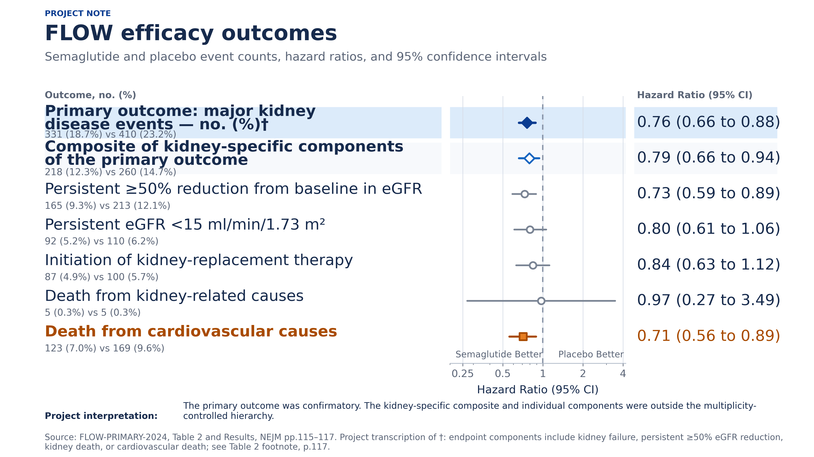

# Semaglutide in CKD: FLOW evidence project

This repository contains a source-grounded, multi-session clinical evidence review of semaglutide in chronic kidney disease, centered on FLOW. The core evidence synthesis is frozen at 2026-09-05; a separate, dynamic PubMed citation/comment/reply inventory was updated through 2026-09-07.

## 主要產出（繁體中文）

- **[FLOW 後引文、評論、作者回覆與新證據深讀](./research/semaglutide_ckd_flow/2026-09-05/21_POST_FLOW_CITATION_COMMENT_REPLY_REVIEW_ZH_TW.md)**：區分 cited-in、正式 CommentIn 與實質回應鏈，並整理背景治療、HR 解讀、mGFR、MRA、SGLT2i、透析與 meta-analysis 的可說／不可說邊界。
- **[腎臟科演講 Cross Sessions 辯論整合](./research/semaglutide_ckd_flow/2026-09-05/20_NEPHROLOGIST_TALK_DEBATE_SYNTHESIS_ZH_TW.md)**：五個獨立 AI 角色針對六個高爭議主題完成交叉詰問，整理成 20／40 分鐘架構、逐題講稿、視覺建議與尖銳 Q&A。
- **[公開繁中同儕校讀增補](./research/semaglutide_ckd_flow/2026-09-05/19_WAVE4_PEER_REVIEW_ADDENDUM_ZH_TW.md)**：腎臟科、內分泌科與方法學角色完成的五項真實跨會話裁決。
- **[更新後完整繁中總論](./research/semaglutide_ckd_flow/2026-09-05/16_FINAL_SYNTHESIS_ZH_TW.md)**：FLOW、SELECT、SOUL、組合治療、安全性、機轉與雙專科觀點的整合文章。
- **[五篇繁中系列文章](./research/semaglutide_ckd_flow/2026-09-05/articles_zh_tw/README.md)**：可分篇閱讀或用於教學與演講準備。
- **[繁中演講投影片證據包](./research/semaglutide_ckd_flow/2026-09-05/presentation_zh_tw/README.md)**：25 張投影片 storyboard、雙專科講稿、Table／Figure／page 定位、可編輯圖表資料與圖像授權指引。
- **[FLOW 後腎臟科講者 8 張增補](./research/semaglutide_ckd_flow/2026-09-05/presentation_zh_tw/POST_FLOW_NEPHROLOGIST_SPEAKER_ADDENDUM_ZH_TW.md)**：可插入既有 deck 的 8 張進階模組，逐張列出原始英文 Table／Figure 定位、內部截圖條件、公開重繪方案、講稿與不可越界的解讀。
- **[繁中投影片視覺素材總目錄](./research/semaglutide_ckd_flow/2026-09-05/presentation_zh_tw/VISUAL_ASSET_CATALOG_ZH_TW.md)**：6 組可直接投影的繁中原創重繪圖，以及逐圖 caption、講稿、source locator 與不可越過的解讀邊界。
- **[英文原文／重繪視覺指南](./research/semaglutide_ckd_flow/2026-09-05/presentation_zh_tw/ENGLISH_ORIGINAL_VISUAL_GUIDE.md)**：6 組英文重繪圖、5 張可依法公開的原始英文 Figure，以及每張的來源原文、授權、圖說與 20–30 秒英文講稿。
- **[結構化來源帳本](./research/semaglutide_ckd_flow/2026-09-05/SOURCE_LEDGER.csv)**：來源識別碼、研究設計、終點、結果、限制與證據分級。

### 投影片視覺預覽

公開簡報素材現含 6 組繁中與 6 組英文原創重繪圖（每組 SVG＋3840×2160 PNG），以及 5 張逐圖核實為 CC BY 4.0 的出版圖。繁中圖說與講稿見[視覺素材總目錄](./research/semaglutide_ckd_flow/2026-09-05/presentation_zh_tw/VISUAL_ASSET_CATALOG_ZH_TW.md)；英文原文、Figure／Table 定位、rights boundary 與英文 speaker cue 見[英文視覺指南](./research/semaglutide_ckd_flow/2026-09-05/presentation_zh_tw/ENGLISH_ORIGINAL_VISUAL_GUIDE.md)。

### English visual preview

研究任務原始規格見 [`Semaglutide ckd and flow evidence prompt.md`](./Semaglutide%20ckd%20and%20flow%20evidence%20prompt.md)。

Local primary papers, supplements, and private PDF-to-Markdown research derivatives—including disclosed legacy processing-rights incidents—are deliberately Git-ignored and are not included in this public repository. Public availability of this synthesis does not grant reuse rights to any cited third-party article, guideline, label, protocol, or supplement.

For the 2026-09-07 post-FLOW update, the private research cache contains 27 unique full-text sources, 27 canonical Markdown conversions plus one alternate LlamaParse comparator (28 Markdown artifacts total), and 24 valid PDFs. The source files were reached without access-control circumvention; that records access provenance only and is not a determination that every automated conversion, TDM/ML operation, or cloud transfer was authorized. Rights-restricted or uncleared derivatives are disclosed as processing incidents and excluded from AI/RAG use. PDFs, full-text derivatives, private manifests, failed retrieval responses, and rights-restricted table/figure screenshots remain local and are not published in GitHub; public artifacts contain source-grounded paraphrases, locators, structured numbers, and independently designed redraw guidance only.

The private `fulltext/` source corpus is guarded read-only by [`scripts/source_corpus_guard.sh`](./scripts/source_corpus_guard.sh); public clones intentionally lack those files, which the guard treats as expected. The tracked presentation deliverables can be checked separately with [`scripts/verify_presentation_pack.sh`](./scripts/verify_presentation_pack.sh).

The public `main` branch is released as a curated, single-root snapshot so superseded local history, internal session logs, private source files, and rights-restricted screenshots are not exposed. The exact inclusion and exclusion boundary is documented in [`PUBLICATION_NOTES.md`](./PUBLICATION_NOTES.md).

On the curated public branch, run `./scripts/verify_public_snapshot.sh --strict-curated` to enforce that boundary and re-run the presentation checks.

The workflow uses persistent Claude Code sessions with distinct clinical and methodological roles. Each lane first produces an independent evidence memo, then reviews another lane, and only then may the director reconcile the evidence and commission the Traditional Chinese synthesis. A first Wave 4 contact attempt failed transparently; a second permission-compatible run completed five genuine challenge/response/rejoinder chains and corrected the public synthesis. A later post-FLOW extension used source-librarian, nephrology, methodology, CKM, and director roles to challenge the new citation/response synthesis; role consensus remains an audit layer, not new medical evidence. See [`ORCHESTRATION.md`](./research/semaglutide_ckd_flow/2026-09-05/orchestration/ORCHESTRATION.md), the public peer-review addendum above, and the post-FLOW review.

Missing literature is resolved through connected research tools and a copyright-aware acquisition log. A PDF may be submitted to LlamaParse only when third-party automated processing is separately permitted; lawful human reading access alone is insufficient. Full-text files are not republished merely because they are readable. See [`ACQUISITION_POLICY.md`](./research/semaglutide_ckd_flow/2026-09-05/sources/ACQUISITION_POLICY.md).

This material is an academic evidence synthesis, not individualized medical advice.
