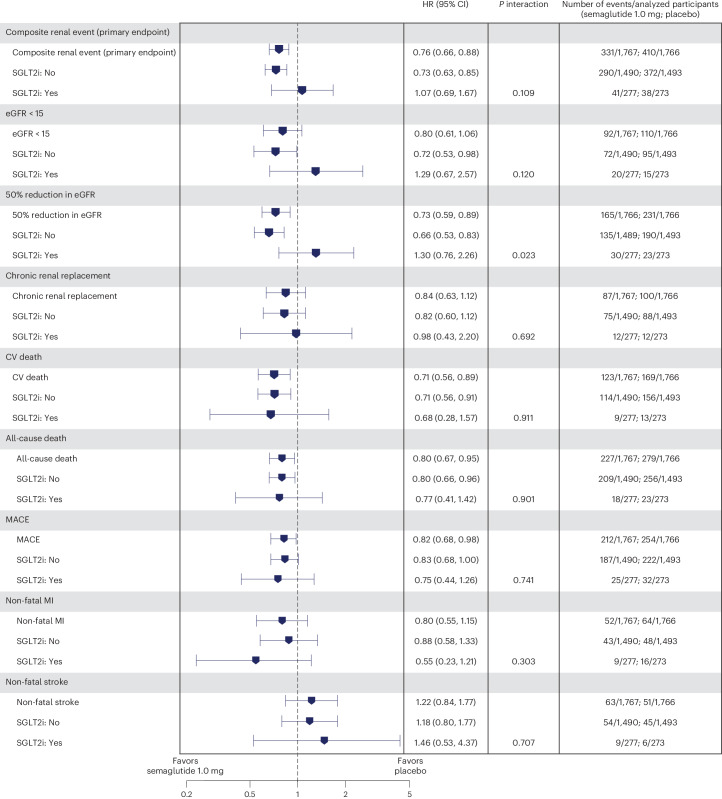

# English guide to original and redrawn visuals

This is the English-language visual-use lane for the semaglutide and CKD presentation pack. It is intentionally separate from the Traditional Chinese storyboard and speaker notes. It tells an English-language presenter what each of the six project figures shows, where every result comes from, when an original source figure may be shown, and which statements are interpretation added by this project.

## Provenance and rights key

| Label | Meaning | Permitted use |
|---|---|---|
| **PUBLIC REDRAW** | The project rebuilt the visual from verified numerical data. No publisher layout, caption, or artwork was copied. | Preferred for the main deck and public GitHub. Cite the underlying article, table/figure, page, and DOI/PMID. |
| **PUBLIC SOURCE FIGURE - CC BY 4.0** | An original English-language source visual is included under CC BY 4.0. | May be used publicly with a same-slide attribution, license link, and an accurate changes statement. |
| **LOCAL-ONLY SOURCE SCREENSHOT** | A page image or crop is stored in the gitignored private cache for source checking. | Do not place it in a public repository or externally distributed deck unless separate permission or an applicable license has been confirmed. |
| **NO SOURCE SCREENSHOT BUNDLED** | The result is documented and redrawn, but no original source image is included in the pack. | Use the redraw. Return to the cited article if a source visual is needed for private verification. |

### Source text versus project text

- **Verbatim source text** appears only inside quotation marks and is explicitly labelled. These are short English endpoint or row labels, not reconstructed captions.
- **Project transcription** restates the source-defined endpoint structure in compact English. It is checked against the cited source but is not represented as a quotation.
- **Project-added interpretation** includes hierarchy, multiplicity, subgroup, estimand, transportability, and clinical-practice cautions. It must never be presented as wording written by the source authors.
- **Speaker cue** is entirely project-authored. It is designed for approximately 20-30 seconds at a normal speaking pace.

## Six-figure crosswalk

| ID | Intended slide | English redraw | Source-original status |
|---|---:|---|---|
| V01 | 5-7, mainly 6-7 | [PNG](./public_assets/redrawn_en/01_flow_endpoints_forest_en@2x.png) / [SVG](./public_assets/redrawn_en/01_flow_endpoints_forest_en.svg) | PUBLIC REDRAW; FLOW Figure 1 and Table 2 screenshots are local-only |
| V02 | 9 | [PNG](./public_assets/redrawn_en/02_flow_egfr_phases_en@2x.png) / [SVG](./public_assets/redrawn_en/02_flow_egfr_phases_en.svg) | PUBLIC REDRAW; FLOW Figure 1D and Table 2 screenshots are local-only |
| V03 | 14 | [PNG](./public_assets/redrawn_en/03_flow_sglt2_subgroup_forest_en@2x.png) / [SVG](./public_assets/redrawn_en/03_flow_sglt2_subgroup_forest_en.svg) | PUBLIC REDRAW; official Figures 1-3 are also packaged unchanged under CC BY 4.0 |
| V04 | 15 | [PNG](./public_assets/redrawn_en/04_flow_mra_subgroup_forest_en@2x.png) / [SVG](./public_assets/redrawn_en/04_flow_mra_subgroup_forest_en.svg) | PUBLIC REDRAW; no source screenshot is bundled |
| V05 | 16 | [PNG](./public_assets/redrawn_en/05_select_soul_pooled_context_en@2x.png) / [SVG](./public_assets/redrawn_en/05_select_soul_pooled_context_en.svg) | PUBLIC REDRAW; the SELECT source figure is also public under CC BY 4.0; SOUL and pooled source visuals are not bundled |
| V06 | 19-20, mainly 19 | [PNG](./public_assets/redrawn_en/06_flow_safety_dotplot_en@2x.png) / [SVG](./public_assets/redrawn_en/06_flow_safety_dotplot_en.svg) | PUBLIC REDRAW; FLOW Table 3 and Supplementary Tables S4-S5 screenshots are local-only |

For PowerPoint or Keynote, use the 3840 x 2160 PNG by default. Use SVG only after checking fonts, line breaks, and clipping in the target application.

## V01. FLOW primary and kidney-specific outcomes

**Intended slide:** Slide 5 for endpoint anatomy, slide 6 for paired reporting of the confirmatory primary and supportive kidney-specific composites, and slide 7 for individual components. The full forest is most useful on slides 6-7.

**Original source locator:** Perkovic et al., *N Engl J Med* 2024;391:109-121, DOI [`10.1056/NEJMoa2403347`](https://doi.org/10.1056/NEJMoa2403347). See Methods, journal pp.110-111 / local PDF pp.2-3; Figure 1A-B, journal p.114 / local PDF p.6; Results, journal p.115 / local PDF p.7; and Table 2, journal p.116 / local PDF p.8.

**Status:** **PUBLIC REDRAW.** The related originals `FLOW_PRIMARY_p06_Figure1.png` and `FLOW_PRIMARY_p08_Table2.png` are **LOCAL-ONLY SOURCE SCREENSHOTS** from NEJM. They are for private source verification, not public reuse.

**Verbatim source text:** “Primary outcome: major kidney disease events — no. (%)†” and “Composite of kidney-specific components of the primary outcome.” The dagger points to the endpoint-definition footnote on journal p.117 / local PDF p.9.

**Project transcription of endpoint structure:** The five-component primary composite counts the first qualifying event among sustained at least 50% eGFR reduction, kidney failure defined by sustained eGFR below 15 or chronic kidney-replacement therapy, kidney death, or cardiovascular death. The four-component kidney-specific composite removes cardiovascular death.

**Project-added interpretation:** HR 0.76 (95% CI 0.66-0.88) is the multiplicity-protected five-component primary result. HR 0.79 (0.66-0.94) is a prespecified supportive kidney-specific result outside the confirmatory hierarchy. Individual KRT, sustained eGFR below 15, and kidney-death rows were not independently confirmed. The reported three-year NNT of 20 belongs only to the five-component primary composite.

**20-30 second speaker cue:** Read the endpoint before the hazard ratio. FLOW's 0.76 belongs to the five-component primary composite, which includes cardiovascular death. The four-component kidney-specific estimate points in the same direction at 0.79, but it is supportive and excludes cardiovascular death. Individual dialysis, low-eGFR, and kidney-death components were not independently confirmed, so the three-year NNT of 20 applies only to the primary composite.

## V02. FLOW eGFR phases

**Intended slide:** Slide 9. Keep the early absolute change, chronic slope, and total slope visually distinct.

**Original source locator:** Perkovic et al., *N Engl J Med* 2024;391:109-121. See Figure 1D, journal p.114 / local PDF p.6; Results, journal p.115 / local PDF p.7; Table 2, journal p.116 / local PDF p.8; and Discussion, journal pp.119-120 / local PDF pp.11-12.

**Status:** **PUBLIC REDRAW.** Source checking uses the local-only `FLOW_PRIMARY_p06_Figure1.png` and `FLOW_PRIMARY_p08_Table2.png`; neither publisher image belongs in the public deck.

**Verbatim source text:** “Mean annual rate of change in eGFR.”

**Project transcription of estimands:** Baseline to week 12 is an absolute eGFR change, not an annualized slope. Chronic slope is the annual rate from week 12 to trial end. Total slope is the annual rate from randomization to trial end.

**Project-added interpretation:** The week-12 between-group difference of -0.03 mL/min/1.73 m² does not show a semaglutide-specific difference persisting to week 12, but it cannot exclude an earlier transient change that had resolved. Chronic and total slope differences of +0.94 and +1.16 mL/min/1.73 m²/year are trial-average estimands and cannot be converted into a patient-specific number of years to dialysis.

**20-30 second speaker cue:** Separate the windows before interpreting the values. Through week 12, both groups lost about one eGFR unit and the between-group difference was nearly zero. From week 12 onward, and over total follow-up, decline was slower with semaglutide. Those are average trial slopes, not a personal trajectory, and they do not justify multiplying 1.16 by time to claim a specific delay to dialysis.

## V03. FLOW by baseline SGLT2 inhibitor use

**Intended slide:** Slide 14. The main panel should retain event counts, confidence intervals, interaction P values, and the distinction between creatinine- and cystatin C-based estimands.

**Original source locator:** Mann et al., *Nat Med* 2024;30:2849-2856, DOI [`10.1038/s41591-024-03133-0`](https://doi.org/10.1038/s41591-024-03133-0), PMCID [`PMC11485243`](https://pmc.ncbi.nlm.nih.gov/articles/PMC11485243/). See Figure 1, journal p.2851; Figure 2, journal p.2852; Table 1, journal p.2853; Results, journal pp.2850-2854; and the CC BY 4.0 notice, journal p.2855.

**Status:** **PUBLIC REDRAW**, plus three **PUBLIC SOURCE FIGURES - CC BY 4.0** for appendix or source-verification use: [Figure 1](./public_assets/source_figures/FLOW_SGLT2_Mann_2024_Figure1.jpg), [Figure 2](./public_assets/source_figures/FLOW_SGLT2_Mann_2024_Figure2.jpg), and [Figure 3](./public_assets/source_figures/FLOW_SGLT2_Mann_2024_Figure3.jpg). Each is the official PMC JPEG with no changes; use the adjacent [attribution record](./public_assets/source_figures/ATTRIBUTION.md).

**Verbatim source text:** “The primary outcome was a composite of kidney failure, ≥50% estimated glomerular filtration rate reduction, kidney death or CV death.”

**Project transcription of endpoint structure:** The primary subgroup outcome is the same five-component FLOW composite, including cardiovascular death. The kidney-specific four-component outcome excludes cardiovascular death. A modified cystatin C analysis changes both the filtration marker and endpoint construction, so it is a different estimand.

**Project-added interpretation:** Baseline SGLT2i use was not factorially randomized. Only 550 participants and 79 primary events were in the SGLT2i stratum. HR 1.07 (0.69-1.67) therefore does not establish harm, no benefit, or additivity. The isolated component interaction P=.023 is nominal and unadjusted. The post hoc modified cystatin C HR 0.74 cannot be averaged with, or used to replace, the prespecified creatinine-based HR.

**Source-original fidelity alert:** Published Figure 2 displays 231 placebo events in the overall 50% eGFR-reduction row, whereas the SGLT2i strata sum to 213 and FLOW Table 2 reports 213. Never edit an original screenshot silently. This project redraw uses the verified subgroup counts and treats 213 as the reconciled value; any public note about the discrepancy is project-authored.

**20-30 second speaker cue:** The estimate of 1.07 in baseline SGLT2 inhibitor users is imprecise, with a confidence interval that permits benefit, no effect, or harm. This was a small background-therapy subgroup, not a factorial combination trial. A post hoc cystatin C analysis gives a different number because it changes the marker and endpoint. The honest conclusion is that incremental hard-kidney benefit on established SGLT2 therapy remains uncertain.

## V04. FLOW by baseline MRA use

**Intended slide:** Slide 15. Keep MRA composition and the zero baseline finerenone count visible beside the forest plot.

**Original source locator:** Rossing et al., *Diabetes Care* 2025;48:1878-1887, DOI [`10.2337/dc25-0472`](https://doi.org/10.2337/dc25-0472), PMCID [`PMC12583412`](https://pmc.ncbi.nlm.nih.gov/articles/PMC12583412/). See Figures 1-2, Table 1, Results, and Supplementary Tables 1-2. The evidence package uses the official Europe PMC XML and figure assets rather than a pagination-bearing publisher PDF, so Figure/Table + DOI + PMCID are the stable locators used here.

**Status:** **PUBLIC REDRAW.** No MRA-paper source screenshot is bundled in either the public assets or the 20-item private manifest. The ADA notice permits an unchanged original only for properly cited educational, not-for-profit use. For public Git inclusion, commercial use, or any crop, highlight, translation, or other alteration, use the fact redraw or obtain permission.

**Verbatim source text:** Figure 2 uses “Composite kidney event (composite primary end point).” The article also uses “four-component kidney-specific composite outcome (excluding CV death from the five-component primary outcome).”

**Project transcription of endpoint structure:** The five-component primary outcome includes cardiovascular death. The secondary four-component kidney-specific outcome removes cardiovascular death. Baseline MRA exposure was mostly spironolactone, with some eplerenone, one esaxerenone user, and no finerenone users.

**Project-added interpretation:** Baseline MRA use was neither randomized nor a randomization stratum, and the paper identifies the analysis as exploratory without multiplicity protection. The MRA stratum contained 257 participants and 59 primary events. The RRT interaction P=.027 rests on only 11 events among MRA users. These data do not directly test semaglutide plus finerenone or prove pharmacologic additivity.

**20-30 second speaker cue:** The 0.51 point estimate in MRA users is striking, but the subgroup was small, baseline MRA exposure was not randomized, and no participant used finerenone at baseline. The renal-replacement interaction is based on only 11 events. This supports clinical compatibility with predominantly steroidal MRA background therapy, but it is not direct evidence that semaglutide and finerenone produce additive hard-kidney benefit.

## V05. SELECT, SOUL, and participant-level pooled context

**Intended slide:** Slide 16. Use separate cards or panels so that different populations, doses, routes, endpoint structures, and inferential status are visible. Do not construct an HR ranking.

**Original source locators:**

- **SELECT:** Colhoun et al., *Nat Med* 2024;30:2058-2066, DOI [`10.1038/s41591-024-03015-5`](https://doi.org/10.1038/s41591-024-03015-5), PMCID [`PMC11271413`](https://pmc.ncbi.nlm.nih.gov/articles/PMC11271413/). Figure 1, journal p.2059 / publisher PDF p.2; Table 1, journal p.2062 / publisher PDF p.5; Results, journal pp.2058-2064.
- **SOUL:** Mann et al., *Diabetes Care* 2026;49:257-265, DOI [`10.2337/dc25-1080`](https://doi.org/10.2337/dc25-1080), PMID [`41380027`](https://pubmed.ncbi.nlm.nih.gov/41380027/). Results, journal p.259; Figure 1 and Table 1, journal p.260; Figure 2, journal p.261.
- **Pooled SELECT/FLOW/SOUL:** *Lancet Diabetes Endocrinol*, DOI [`10.1016/S2213-8587(26)00134-8`](https://doi.org/10.1016/S2213-8587(26)00134-8), PMID [`42567173`](https://pubmed.ncbi.nlm.nih.gov/42567173/). Endpoint definitions and estimates are verified from the official PubMed Methods and Findings. No public source Figure/Table/page is bundled in this project at the evidence cutoff.

**Status:** **PUBLIC REDRAW.** The public CC BY crop [SELECT Figure 1](./public_assets/source_figures/SELECT_KIDNEY_Colhoun_2024_Figure1_KM.png) is available for appendix or Q&A use with same-slide attribution. `SELECT_KIDNEY_p02_Figure1_kidney_composite_300dpi.png` and `SELECT_KIDNEY_p06_Figure4_eGFR_UACR_300dpi.png` remain in the private cache. No SOUL or pooled source visual is approved for public reuse here.

**Verbatim source text:**

- SELECT Figure 1: “Time to first occurrence of the main 5-component kidney composite endpointᵃ.” The superscript points to the source endpoint-definition footnote.
- SOUL Figure 1: “First 5-point composite kidney event” and “First 4-point composite kidney event.”
- Pooled Methods: “primary kidney composite” and “a narrower secondary kidney composite (excluding cardiovascular-related death from the primary outcome).”

**Project transcription of endpoint structures:** SELECT includes kidney death, chronic KRT, persistent eGFR below 15, persistent at least 50% eGFR reduction, and new-onset persistent macroalbuminuria; it excludes cardiovascular death. SOUL's five-component outcome includes cardiovascular death, while its four-component outcome excludes it. The pooled primary definition harmonizes persistent at least 50% eGFR decline, kidney failure, kidney death, and cardiovascular death; its narrower secondary composite excludes cardiovascular death.

**Project-added interpretation:** SELECT HR 0.78 (0.63-0.96), P=.02, is a prespecified secondary result without multiplicity adjustment. SOUL's five-component kidney/CV-death gate was not significant at HR 0.91 (0.80-1.05), P=.19, so later slope inference is formally exploratory. The pooled HR 0.84 (0.77-0.91) is participant-level and statistically dependent on the component trials. It is not a fourth independent trial and cannot support dose, route, or cross-trial efficacy ranking.

**20-30 second speaker cue:** These estimates sit on one page for context, not comparison. SELECT uses a macroalbuminuria-inclusive endpoint without cardiovascular death; SOUL's cardiovascular-death-inclusive kidney gate was not significant; and the pooled estimate reuses participants from SELECT, FLOW, and SOUL under a harmonized definition. The panels therefore cannot tell us that 2.4 mg beats 1 mg, that injection beats oral therapy, or that one trial produced the best effect.

## V06. FLOW safety and permanent discontinuation

**Intended slide:** Slide 19 for the quantitative safety comparison, with selected renal, volume, hypoglycemia, and eye-risk rows supporting the clinical monitoring discussion on slide 20.

**Original source locator:** Perkovic et al., *N Engl J Med* 2024;391:109-121, Table 3, journal p.120 / local PDF p.12, supplies serious adverse events, severe hypoglycemia, and diabetic retinopathy. FLOW Supplementary Appendix Table S4 supplies the AKI row on PDF p.29 and dehydration row on p.30. Table S5 supplies overall and gastrointestinal-disorder permanent-discontinuation rows on supplement PDF p.32.

**Status:** **PUBLIC REDRAW.** `FLOW_PRIMARY_p12_Table3.png`, `FLOW_SUPP_p28_TableS4.png`, `FLOW_SUPP_p29_TableS4_AKI.png`, `FLOW_SUPP_p30_TableS4_Dehydration.png`, and `FLOW_SUPP_p32_TableS5.png` are **LOCAL-ONLY SOURCE SCREENSHOTS**.

**Verbatim source text:** Primary Table 3 uses “Diabetic retinopathy*” and “Severe hypoglycemia*”; the asterisks point to the source footnote on journal p.120. Supplementary Table S4 uses “Acute kidney injury” and “Dehydration.” Table S5 uses “Adverse events leading to permanent trial product discontinuation” and “Gastrointestinal disorders.”

**Project transcription of safety taxonomy:** Overall adverse-event discontinuation and GI-specific discontinuation are nested, not additive. The redraw retains the plural Table S5 discontinuation label and the Table 3 asterisk markers; its short asterisk note points readers back to the complete Table 3 footnote. AKI and dehydration values in the redraw are serious-adverse-event preferred-term rows. Do not conflate the Table S4 AKI row with the broader acute-kidney-failure category in primary Table 3. Systematically collected diabetic-retinopathy events and serious eye-disorder system-organ-class events are different classifications. Severe-hypoglycemia participant counts and episode counts use different units.

**Project-added interpretation:** Trial-level serious adverse events and the selected serious-AE AKI/dehydration rows do not show an unfavorable numerical imbalance, while GI-related permanent discontinuation is higher with semaglutide. These averages do not eliminate patient-level risk during vomiting, poor intake, diuretic or RAAS-inhibitor use, intercurrent illness, frailty, or rapid metabolic change.

**20-30 second speaker cue:** Each row has its own denominator and event definition. GI-related discontinuation is part of, not additional to, all adverse-event discontinuation. Serious-AE AKI was numerically balanced, but that does not remove the need to monitor volume status and kidney function when intake falls or vomiting occurs. Likewise, the retinopathy and eye-disorder rows are different surveillance categories and should not be merged.

## Public original English figures under CC BY 4.0

Five original English source figures are currently packaged for public use. They are best reserved for appendix, Q&A, or a deliberate return-to-source slide. Attribution must be visible on the same slide, not only in an end bibliography.

| ID | Public file and intended slide | Source locator | License, changes, and integrity | Required use boundary |
|---|---|---|---|---|
| S01 | [Mahaffey Figure 2](./public_assets/FLOW_CKDSEVERITY_Mahaffey_Figure2.jpg), slides 12-13 appendix | Mahaffey et al., *Eur Heart J* 2025;46:1096-1108, Figure 2, journal p.1103; DOI `10.1093/eurheartj/ehae613`; PMCID `PMC11931213` | CC BY 4.0; unmodified official PMC image `ehae613f2.jpg`; SHA-256 `6ae529d670dee31eb7ca67d6893b9d613a70c295da9124023d30e3d59b79c9a6` | Shows MACE estimates across CKD-severity strata. A nonsignificant interaction does not establish identical effects, and the figure supplies no stratum-specific ARR or NNT. |
| S02 | [SELECT Figure 1](./public_assets/source_figures/SELECT_KIDNEY_Colhoun_2024_Figure1_KM.png), slide 16 appendix | Colhoun et al., *Nat Med* 2024;30:2058-2066, Figure 1, journal p.2059 / publisher PDF p.2; DOI `10.1038/s41591-024-03015-5`; PMCID `PMC11271413` | CC BY 4.0; crop only, with curves, axes, estimate, risk table, figure label, and endpoint explanation retained; 2280 x 3330 RGB PNG; SHA-256 `3c59c3ea870f76e2898cb5a9d76c1b9faf3da5c718d713a2186dd11055e11bfa` | The endpoint includes new persistent macroalbuminuria and excludes cardiovascular death. It is not structurally identical to FLOW's primary composite. |
| S03 | [Mann Figure 1](./public_assets/source_figures/FLOW_SGLT2_Mann_2024_Figure1.jpg), slide 14 appendix | Mann et al., *Nat Med* 2024;30:2849-2856, Figure 1, journal p.2851; DOI `10.1038/s41591-024-03133-0`; PMCID `PMC11485243` | CC BY 4.0; official PMC JPEG, no changes; SHA-256 `763d5c86292cac8bf8a92b4e544ec743fe3f62156fb2a9bb19af351029f4a1eb` | Shows the five-component and four-component cumulative-incidence plots by baseline SGLT2i use. Baseline therapy was not randomized. |
| S04 | [Mann Figure 2](./public_assets/source_figures/FLOW_SGLT2_Mann_2024_Figure2.jpg), slide 14 appendix | Same work, Figure 2, journal p.2852 | CC BY 4.0; official PMC JPEG, no changes; SHA-256 `d7d341281b473522b8ba830ff26779c7b335923ddbb547e944b47ddcf5743110` | Preserves the published English forest plot, including its 231-event display discrepancy. Do not silently correct the original; use V03 for the reconciled presentation. |
| S05 | [Mann Figure 3](./public_assets/source_figures/FLOW_SGLT2_Mann_2024_Figure3.jpg), slide 14 appendix | Same work, Figure 3, journal p.2853 | CC BY 4.0; official PMC JPEG, no changes; SHA-256 `33d1b35ca01d69aeade75b8ef565d94b493f9fb33d361753414f770cec89e9c3` | Shows creatinine- and cystatin C-based eGFR trajectories. The post hoc cystatin C endpoint is a different estimand from the prespecified creatinine-based endpoint. |

### Original English source preview: Mann Figure 2

Use the unchanged source figure for appendix or close source-reading. Use V03 on the main screen because it enlarges the three decision-relevant rows and explicitly separates the published image discrepancy from the verified redraw.

Use these credits verbatim as project attribution text:

> Reproduced from Mahaffey et al., Eur Heart J 2025;46:1096-1108, Fig. 2, DOI 10.1093/eurheartj/ehae613, CC BY 4.0. No changes.

> Adapted from Colhoun et al., Nat Med 2024;30:2058-2066, Fig. 1, DOI 10.1038/s41591-024-03015-5, CC BY 4.0. Change: crop only.

> Reproduced from Mann et al., Nat Med 2024;30:2849-2856, Fig. X, DOI 10.1038/s41591-024-03133-0, CC BY 4.0. No changes.

If any image is further cropped, translated, highlighted, recolored, or annotated, change `Reproduced from` to `Adapted from` where appropriate and state the new changes. Full rights records are in [Mahaffey attribution](./public_assets/ATTRIBUTION.md) and the [SELECT/Mann attribution record](./public_assets/source_figures/ATTRIBUTION.md).

## Private source screenshot inventory

The authoritative 20-item record, including full SHA-256 hashes, is [PRIVATE_ASSET_MANIFEST.md](./PRIVATE_ASSET_MANIFEST.md). All files below live in the gitignored `sources/retrieved/cache/presentation_assets/source_pages/` directory. “Local” describes the repository packaging decision; it does not replace the underlying license terms.

| # | Local filename | What it verifies | Slide | Rights/public status |
|---:|---|---|---:|---|
| 1 | `FLOW_PRIMARY_p04_Table1A.png` | FLOW Table 1, first half | 3-4 appendix | NEJM; local source verification only |
| 2 | `FLOW_PRIMARY_p05_Table1B.png` | FLOW Table 1, second half and background medications | 4 appendix | NEJM; local source verification only |
| 3 | `FLOW_PRIMARY_p06_Figure1.png` | Primary-endpoint cumulative-incidence curves | 6 appendix | NEJM; local source verification only |
| 4 | `FLOW_PRIMARY_p08_Table2.png` | Primary, component, kidney-specific, MACE, and slope results | 5-9 appendix | NEJM; local source verification only |
| 5 | `FLOW_PRIMARY_p10_Figure2.png` | Prespecified primary-outcome subgroup forest | 12-14 appendix | NEJM; local source verification only |
| 6 | `FLOW_PRIMARY_p12_Table3.png` | Overall safety and serious adverse events | 19 appendix | NEJM; local source verification only |
| 7 | `FLOW_SUPP_p16_InterimMethods.png` | Group-sequential interim methods and DMC/lock record | 11 appendix | NEJM supplement; local source verification only |
| 8 | `FLOW_SUPP_p17_Hierarchy.png` | Confirmatory secondary endpoint hierarchy | 11 appendix | NEJM supplement; local source verification only |
| 9 | `FLOW_SUPP_p18_FigureS1.png` | Participant flow | 3/11 appendix | NEJM supplement; local source verification only |
| 10 | `FLOW_SUPP_p19_FigureS2.png` | UACR, weight, and other longitudinal changes | 10 appendix | NEJM supplement; local source verification only |
| 11 | `FLOW_SUPP_p28_TableS4.png` | Start of Supplementary Table S4 | 19-20 appendix | NEJM supplement; local source verification only |
| 12 | `FLOW_SUPP_p29_TableS4_AKI.png` | AKI and serious-GI preferred-term rows | 19-20 appendix | NEJM supplement; local source verification only |
| 13 | `FLOW_SUPP_p30_TableS4_Dehydration.png` | Dehydration, hypoglycemia, and eye-disorder rows | 19-20 appendix | NEJM supplement; local source verification only |
| 14 | `FLOW_SUPP_p32_TableS5.png` | Permanent discontinuation | 19 appendix | NEJM supplement; local source verification only |
| 15 | `FLOW_CKDSEVERITY_p08_Figure2.png` | Mahaffey Figures 2 and 3 on one page | 12-13 appendix | Local page image from a CC BY 4.0 work; use public S01 instead |
| 16 | `FLOW_DESIGN_p04_Figure2_trial_design_300dpi.png` | FLOW design and dose-escalation timeline | 3-4 appendix | CC BY-NC 4.0; local cache; prefer a new redraw for public or commercial use |
| 17 | `FLOW_DESIGN_p05_Table1_eligibility_300dpi.png` | FLOW eligibility table | 3 appendix | CC BY-NC 4.0; local cache; prefer a new redraw for public or commercial use |
| 18 | `SELECT_KIDNEY_p02_Figure1_kidney_composite_300dpi.png` | SELECT Figure 1, complete kidney-composite curves and risk table | 16 appendix | CC BY 4.0 local high-resolution crop; use public S02 with same-slide attribution |
| 19 | `SELECT_KIDNEY_p06_Figure4_eGFR_UACR_300dpi.png` | SELECT Figure 4 eGFR/UACR trajectories and numbers contributing | 16 appendix | CC BY 4.0 local crop; external use requires attribution, changes statement, and data-sparsity note |
| 20 | `FLOW_CKDSEVERITY_p08_Figure2_MACE_forest_300dpi.png` | Mahaffey Figure 2 MACE forest | 12-13 appendix | CC BY 4.0 local high-resolution crop; use public S01 or label any altered version accurately |

## Slide-side language and release checks

For every English slide that uses these assets:

1. Put the population, endpoint, time window, estimate, 95% CI, and inferential status on the same slide.
2. Label supportive, exploratory, post hoc, nominal, or multiplicity-unadjusted results where the number appears.
3. Do not let `no significant interaction` become `same effect`, `safe combination`, or `proven additivity`.
4. Do not compare SELECT, FLOW, SOUL, and pooled HRs as independent like-for-like estimates.
5. Keep the pooled endpoint definition as verified, while stating that the pooled estimate statistically reuses the component trials.
6. Keep original source wording and project interpretation in visibly separate blocks if both appear on one slide.
7. Use `Data redrawn from ...; original figure/table not reproduced` for V01-V06. Use the complete CC BY credit and change statement for S01-S05.
8. Confirm that no file listed in the private manifest, source PDF, parsed full text, API key, or session log enters the public release.
