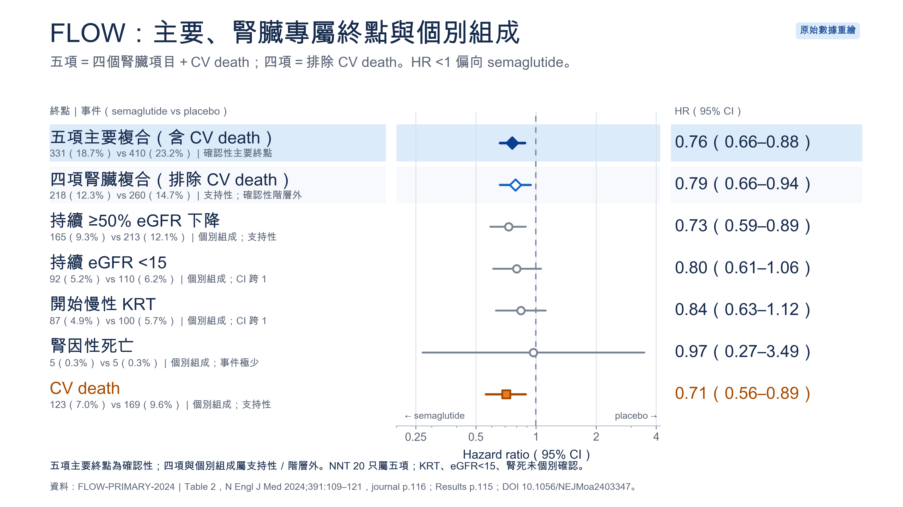
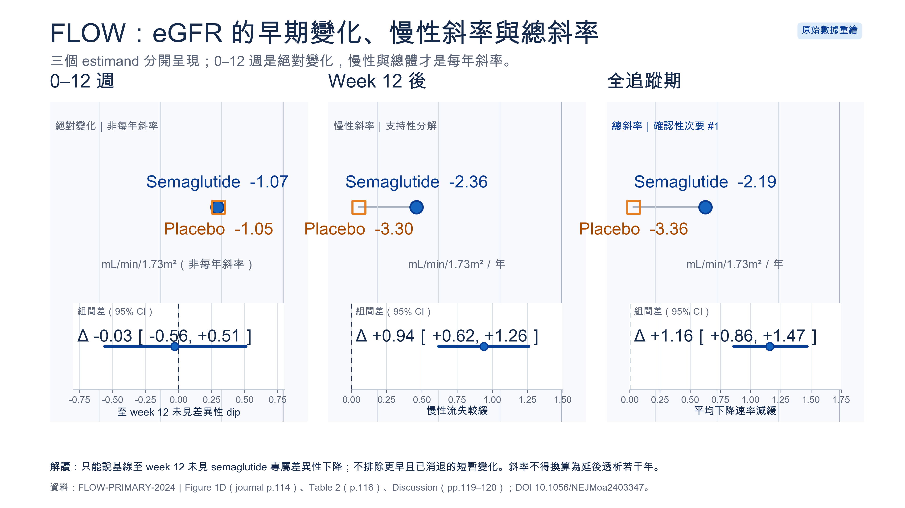
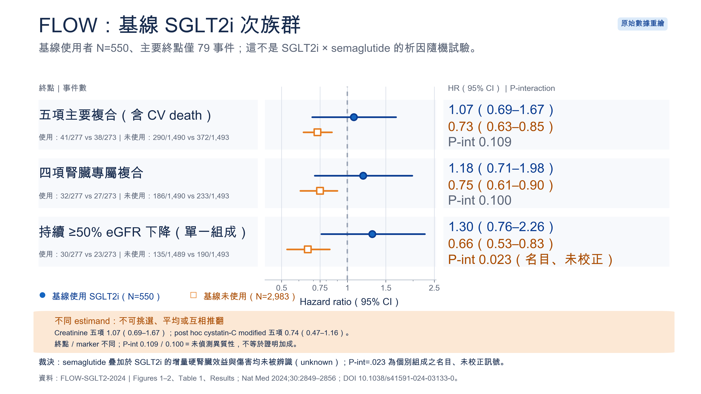
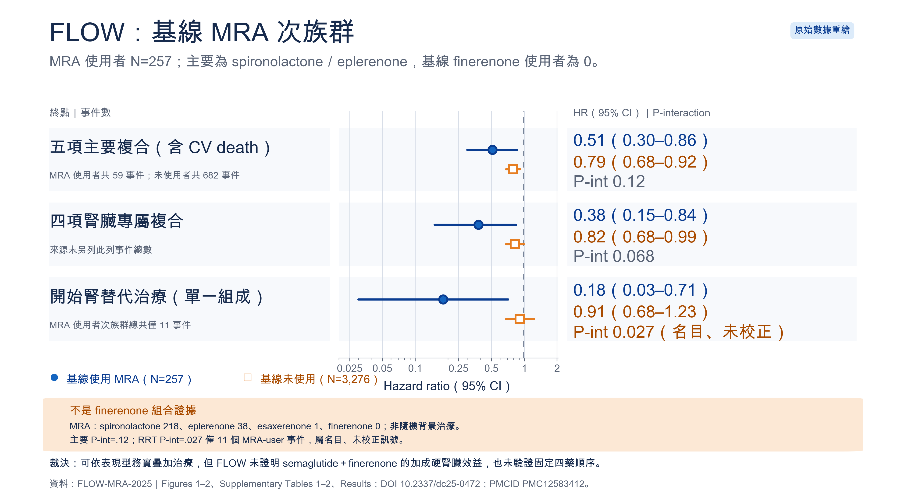
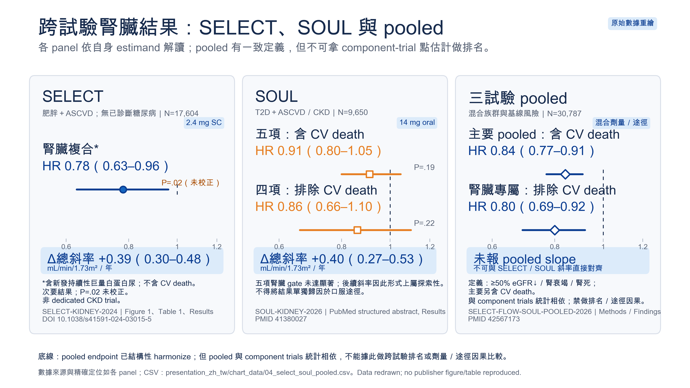
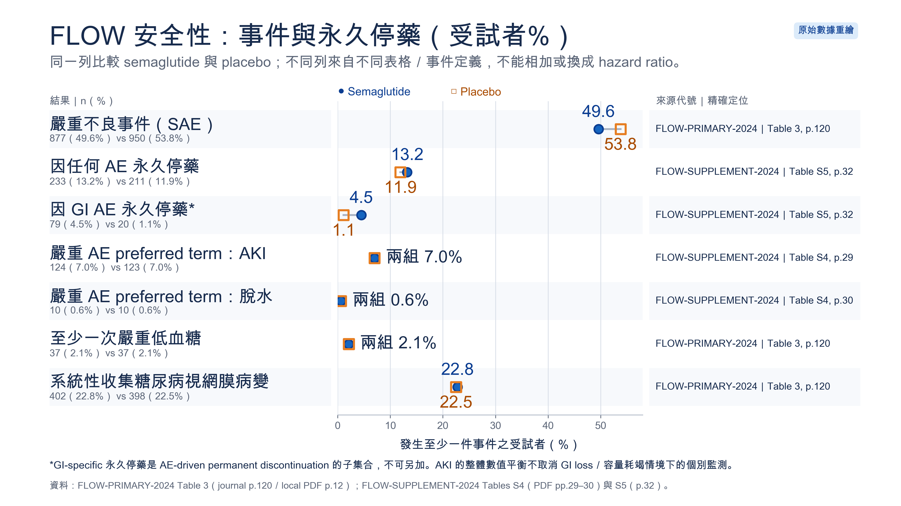
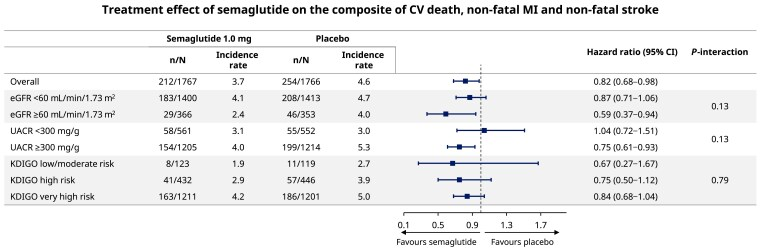
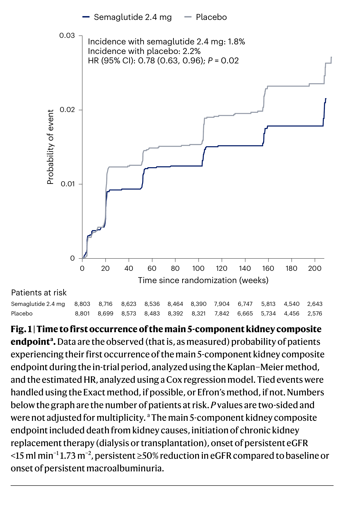

# Semaglutide × CKD：投影片視覺素材總目錄

本目錄把「原論文證據定位」轉成可以直接放入演講的圖像。現有公開素材包含 **6 組原創數據重繪圖**（每組 SVG＋3840×2160 PNG）及 **2 張逐圖核實為 CC BY 4.0 的來源圖**；另有 **20 張本機來源頁／裁圖**供數據核對，但不會上傳 GitHub。

## 先選哪一種素材

| 素材 | 最適合的 slide | 現場用途 | 公開狀態 |
|---|---:|---|---|
| [V01 FLOW 終點 forest](./public_assets/redrawn/01_flow_endpoints_forest_zh_tw@2x.png) | 5–7 | 五項、四項與個別組成一次講清楚 | 原創重繪，可公開 |
| [V02 eGFR 三階段](./public_assets/redrawn/02_flow_egfr_phases_zh_tw@2x.png) | 9 | 分開 0–12 週、慢性與總斜率 | 原創重繪，可公開 |
| [V03 SGLT2i 次族群 forest](./public_assets/redrawn/03_flow_sglt2_subgroup_forest_zh_tw@2x.png) | 14 | 顯示 CI、interaction 與 estimand 不確定性 | 原創重繪，可公開 |
| [V04 MRA 次族群 forest](./public_assets/redrawn/04_flow_mra_subgroup_forest_zh_tw@2x.png) | 15 | 阻止把 MRA 次族群誤稱 finerenone 組合證據 | 原創重繪，可公開 |
| [V05 SELECT／SOUL／pooled](./public_assets/redrawn/05_select_soul_pooled_context_zh_tw@2x.png) | 16 | 三個脈絡分開呈現，不做 HR 排名 | 原創重繪，可公開 |
| [V06 FLOW safety dot plot](./public_assets/redrawn/06_flow_safety_dotplot_zh_tw@2x.png) | 19–20 | 把 SAE、停藥、GI、AKI、眼睛與低血糖變成可視比較 | 原創重繪，可公開 |
| [S01 Mahaffey Figure 2](./public_assets/FLOW_CKDSEVERITY_Mahaffey_Figure2.jpg) | 12–13 appendix | 出版森林圖，用於 CKD 嚴重度下的 MACE | CC BY 4.0，可公開；須保留署名 |
| [S02 SELECT Figure 1](./public_assets/source_figures/SELECT_KIDNEY_Colhoun_2024_Figure1_KM.png) | 16 appendix | 出版 Kaplan–Meier 圖與 number at risk | CC BY 4.0，可公開；本檔為 crop-only adaptation |

正式主畫面優先使用 V01–V06：繁中、字大、推論邊界已內嵌。S01–S02 適合用在 appendix、Q&A 或「回到原始證據」頁。**PowerPoint／Keynote 預設使用 3840×2160 PNG**；SVG 適合繼續編排，但匯入後須先在目標軟體實測字形與縮放，確認無誤才使用。

## V01｜FLOW 終點 forest：24% 到底指什麼？



- **圖表在回答什麼：** semaglutide 對 FLOW 五項主要複合、四項腎臟專屬複合及個別組成的相對效果。
- **關鍵資料：** 五項、含 CV death 的確認性主要終點 HR 0.76（0.66–0.88）；四項、排除 CV death 的支持性複合 HR 0.79（0.66–0.94）。KRT、eGFR<15 與腎因性死亡的個別 CI 均跨 1。
- **精確來源：** `FLOW-PRIMARY-2024`，Results「Primary Outcomes」journal p.115；Table 2 journal p.116；DOI `10.1056/NEJMoa2403347`。
- **建議圖說：**「FLOW 降低的是含 CV death 的五項確認性主要複合終點；排除 CV death 的四項結果方向一致但屬支持性，個別腎衰竭組成未被單獨確認。」
- **30 秒講稿：**「先不要只看 24%。這個數字對應包含 CV death 的五項複合。排除 CV death 後 HR 是 0.79，但位於確認性階層之外；KRT、eGFR<15 與腎因性死亡也沒有各自被試驗單獨證明。因此 NNT 20 不能翻譯成預防一例透析。」
- **不可說：**「透析降低 16%」、「腎衰竭降低 20%」或「24% 全部是腎臟效益」。
- **檔案：** [SVG](./public_assets/redrawn/01_flow_endpoints_forest_zh_tw.svg)／[2× PNG](./public_assets/redrawn/01_flow_endpoints_forest_zh_tw@2x.png)。

## V02｜eGFR 三階段：不要把不同 estimand 混成一條線



- **圖表在回答什麼：** 0–12 週絕對變化、week 12 後慢性斜率與全追蹤總斜率有何不同。
- **關鍵資料：** 0–12 週組間差 −0.03（−0.56 至 0.51）mL/min/1.73m²；慢性斜率差 +0.94（0.62–1.26）及總斜率差 +1.16（0.86–1.47）mL/min/1.73m²/year。
- **精確來源：** `FLOW-PRIMARY-2024`，Figure 1D journal p.114；Table 2 p.116；Discussion pp.119–120。
- **建議圖說：**「至第 12 週未見 semaglutide 特異的 differential dip；第 12 週後與全追蹤期的平均 eGFR 流失較慢。」
- **30 秒講稿：**「前 12 週兩組都下降約 1.06，組間差幾乎為零；這只能排除『到第 12 週仍存在的額外差異』，不能排除更早且已消退的短暫 dip。慢性與總斜率則清楚分離，但這是試驗平均，不能換算成每個人延後洗腎幾年。」
- **不可說：**「完全沒有 acute dip」、「每人每年保留 1.16 eGFR」或「可延後透析 X 年」。
- **檔案：** [SVG](./public_assets/redrawn/02_flow_egfr_phases_zh_tw.svg)／[2× PNG](./public_assets/redrawn/02_flow_egfr_phases_zh_tw@2x.png)。

## V03｜基線 SGLT2i：把寬 CI 與不同 estimand 畫出來



- **圖表在回答什麼：** 已使用 SGLT2i 的病人，是否已證明加入 semaglutide 可再降低硬腎臟結果。
- **關鍵資料：** users N=550；五項主要終點 HR 1.07（0.69–1.67）vs 0.73（0.63–0.85），P-interaction=.109；四項結果 P-interaction=.100。孤立的 ≥50% eGFR decline component P-interaction=.023 為名目、未校正訊號。
- **精確來源：** `FLOW-SGLT2-2024`，Figures 1–2、Table 1、Results；DOI `10.1038/s41591-024-03133-0`。
- **建議圖說：**「基線 SGLT2i 次族群事件少且 CI 寬；未證明增量硬腎臟效益，也未證明傷害或加成性。」
- **30 秒講稿：**「HR 1.07 並不是『不能加』，因為區間同時容許效益、無效與傷害。事後 modified cystatin-C 的 0.74 又是不同 marker、不同 endpoint definition 的 estimand，兩者不能平均或互相推翻。現有答案就是 unknown。」
- **不可說：**「已證明有加成」、「已證明沒有加成」或「SGLT2i 使用者會受害」。
- **檔案：** [SVG](./public_assets/redrawn/03_flow_sglt2_subgroup_forest_zh_tw.svg)／[2× PNG](./public_assets/redrawn/03_flow_sglt2_subgroup_forest_zh_tw@2x.png)。

## V04｜基線 MRA：不是 semaglutide＋finerenone 的直接證據



- **圖表在回答什麼：** MRA 使用與否是否改變 semaglutide 的相對效果，以及能否外推到 finerenone。
- **關鍵資料：** MRA users N=257；五項主要終點 HR 0.51（0.30–0.86）vs 0.79（0.68–0.92），P-interaction=.12；基線 finerenone 使用者為 0。RRT P-interaction=.027 只建立在 MRA-user 次族群 11 件事件。
- **精確來源：** `FLOW-MRA-2025`，Figures 1–2、Supplementary Tables 1–2、Results；DOI `10.2337/dc25-0472`；PMCID `PMC12583412`。
- **建議圖說：**「FLOW 的 MRA 次族群幾乎全為 spironolactone／eplerenone；探索性結果不能改寫成 semaglutide＋finerenone 的加成證據。」
- **30 秒講稿：**「0.51 的點估計很吸睛，但背景 MRA 沒有隨機分派、樣本與事件都少，而且沒有任何 finerenone 使用者。RRT 的交互作用又只來自 11 件事件。可以說臨床上可能同時使用，不能說四重治療的硬腎臟加成已被證明。」
- **不可說：**「FLOW 證明 semaglutide＋finerenone」或「P-interaction 不顯著等於兩組效果相同」。
- **檔案：** [SVG](./public_assets/redrawn/04_flow_mra_subgroup_forest_zh_tw.svg)／[2× PNG](./public_assets/redrawn/04_flow_mra_subgroup_forest_zh_tw@2x.png)。

## V05｜SELECT、SOUL、pooled：同一 HR 軸不等於可排名



- **圖表在回答什麼：** 三個不同族群、劑量／途徑與複合終點的結果，如何並列而不假裝 like-for-like。
- **關鍵資料：** SELECT HR 0.78（0.63–0.96），P=.02 未校正多重比較；SOUL 五項 kidney/CV-death composite HR 0.91（0.80–1.05），P=.19；pooled source-labelled aggregate HR 0.84（0.77–0.91）。
- **精確來源：** `SELECT-KIDNEY-2024` Figure 1、Table 1、Results；`SOUL-KIDNEY-2026` PubMed Results, PMID `41380027`；`SELECT-FLOW-SOUL-POOLED-2026` PubMed Findings, PMID `42567173`。
- **建議圖說：**「Pooled endpoint 定義已協調，但估計值包含 FLOW、SELECT、SOUL 的參與者；族群、劑量／途徑不同，不能與母試驗當成三個獨立 HR 排名。」
- **30 秒講稿：**「SELECT 原始終點含新發巨量白蛋白尿但不含 CV death；SOUL 的五項 gate 未達顯著，後續斜率形式上屬探索性。Pooled analysis 另以統一定義重建含 CV death 與排除 CV death 的終點，但它已把三個試驗包進去，所以這一頁是脈絡圖，不是三個獨立估計的排行榜。」
- **不可說：**「2.4 mg 優於 14 mg」、「皮下注射優於口服」或把三個 HR 當同一終點比較。
- **檔案：** [SVG](./public_assets/redrawn/05_select_soul_pooled_context_zh_tw.svg)／[2× PNG](./public_assets/redrawn/05_select_soul_pooled_context_zh_tw@2x.png)。

## V06｜安全性 dot plot：相同百分比也要保留事件定義



- **圖表在回答什麼：** 兩組整體 SAE、停藥、GI、AKI、脫水、低血糖與視網膜病變的受試者比例。
- **關鍵資料：** SAE 49.6% vs 53.8%；所有 AE 永久停藥 13.2% vs 11.9%；GI-specific 永久停藥 4.5% vs 1.1%；serious-AE preferred-term AKI 7.0% vs 7.0%。
- **精確來源：** `FLOW-PRIMARY-2024` Table 3 journal p.120／local PDF p.12；`FLOW-SUPPLEMENT-2024` Table S4 PDF pp.29–30、Table S5 p.32。
- **建議圖說：**「整體 SAE 與 serious-AE AKI 未見不利數值失衡，但 GI 相關停藥較多；平均試驗數字不能取消個別病人的容量耗竭監測。」
- **30 秒講稿：**「不同列不是同一事件定義。GI-specific 停藥是所有 AE 停藥的子集，不能相加。AKI 的整體數字平衡，也不能讓我們忽略噁心、嘔吐、攝取下降、利尿劑與 RAASi 共同造成的個別風險。」
- **不可說：**「AKI 風險為零」、「眼睛完全安全」或把 serious eye SOC 與系統性收集的 retinopathy 當同一終點。
- **檔案：** [SVG](./public_assets/redrawn/06_flow_safety_dotplot_zh_tw.svg)／[2× PNG](./public_assets/redrawn/06_flow_safety_dotplot_zh_tw@2x.png)。

## S01｜Mahaffey Figure 2：CKD 嚴重度下的 MACE 原圖



- **用途：** Slide 12–13 的原始出版證據或 appendix；讀 eGFR、UACR、KDIGO risk 分層估計與 interaction。
- **精確來源：** `FLOW-CKDSEVERITY-2025`，Figure 2 journal p.1103；DOI [`10.1093/eurheartj/ehae613`](https://doi.org/10.1093/eurheartj/ehae613)；PMCID [`PMC11931213`](https://pmc.ncbi.nlm.nih.gov/articles/PMC11931213/)。
- **建議圖說：**「FLOW 的 MACE 相對效果在 CKD 嚴重度分層未偵測到顯著異質性；這不證明各層效果相同，也不提供分層 ARR／NNT。」
- **建議同頁 credit：** `Reproduced from Mahaffey et al., Eur Heart J 2025;46:1096–1108, Fig. 2, DOI 10.1093/eurheartj/ehae613, CC BY 4.0. No changes.`
- **授權：** [CC BY 4.0](https://creativecommons.org/licenses/by/4.0/)；完整紀錄見 [ATTRIBUTION](./public_assets/ATTRIBUTION.md)。如再裁切、翻譯或加標記，改寫為 `Adapted from` 並描述變更。

## S02｜SELECT Figure 1：原始 Kaplan–Meier 圖



- **用途：** Slide 16 appendix 或 Q&A；顯示兩組曲線、HR 0.78（0.63–0.96）、P=.02 與完整 number at risk。
- **精確來源：** `SELECT-KIDNEY-2024`，Figure 1 journal p.2059／publisher PDF p.2；DOI [`10.1038/s41591-024-03015-5`](https://doi.org/10.1038/s41591-024-03015-5)；PMCID [`PMC11271413`](https://pmc.ncbi.nlm.nih.gov/articles/PMC11271413/)。
- **建議圖說：**「SELECT 在無已診斷糖尿病的 overweight／obesity＋ASCVD 族群顯示腎臟次要複合終點下降；該五項終點包含新發持續性巨量白蛋白尿、排除 CV death，不能視為 FLOW 的結構性複製。」
- **建議同頁 credit：** `Adapted from Colhoun et al., Nat Med 2024;30:2058–2066, Fig. 1, DOI 10.1038/s41591-024-03015-5, CC BY 4.0. Change: crop only.`
- **授權：** [CC BY 4.0](https://creativecommons.org/licenses/by/4.0/)；完整裁切與 checksum 紀錄見 [ATTRIBUTION](./public_assets/source_figures/ATTRIBUTION.md)。

## 本機來源截圖：如何使用而不越過授權邊界

本機 private cache 目前有 20 張來源頁／高解析裁圖，包含 FLOW Table 1–3、Figure 1–2、Supplement Figures／Tables、FLOW design、SELECT Figures 1／4 與 Mahaffey Figure 2。逐張 SHA、像素、頁碼、繁中圖說與講稿見 [PRIVATE_ASSET_MANIFEST.md](./PRIVATE_ASSET_MANIFEST.md)。

- NEJM FLOW 主文與 supplement：**只作本機來源核對**；無 publisher permission 時，不放外部演講或公開 GitHub，改用 V01、V02、V06。
- SOUL、透析後分析及 ADA/AHA 限制來源：不製作或散布原圖；只用已獨立核實的必要事實做原創重繪。
- CC BY 圖：逐圖確認 caption 沒有第三方 credit 例外，並在同頁保留作者、期刊、Figure、DOI、授權連結與 changes statement。

## 文章與投影片的引用格式

重繪圖頁腳範例：

> Data redrawn from Perkovic et al., *N Engl J Med* 2024;391:109–121, Table 2, p.116, DOI 10.1056/NEJMoa2403347; original figure/table not reproduced.

CC BY 原圖範例：

> Adapted from Colhoun et al., *Nat Med* 2024;30:2058–2066, Fig. 1, p.2059, DOI 10.1038/s41591-024-03015-5, CC BY 4.0. Change: crop only.

文章中的簡寫應直接貼近數字，例如：`HR 0.76（95% CI 0.66–0.88；FLOW-PRIMARY-2024, Table 2, p.116）`。若是 post hoc、exploratory、nominal 或 unadjusted，必須在同一句或同一表格欄位標示，不能只留到文末參考文獻。

## 重現與 QA

執行下列命令可由 `chart_data/*.csv` 重製 V01–V06：

```bash
python3 scripts/generate_presentation_visuals.py
```

每次重製後應再次檢查：數值／CI、endpoint definition、推論層級、字體與裁切、source locator，以及 public-snapshot 權利閘門。圖表生成程式不讀取來源 PDF、全文解析、private cache 或任何 API key。
